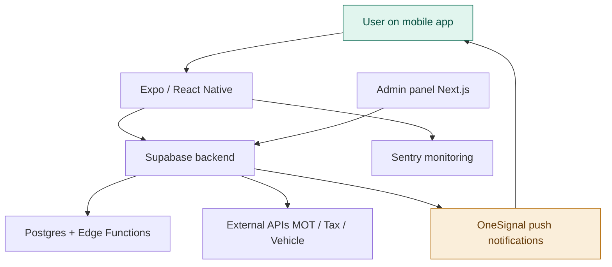
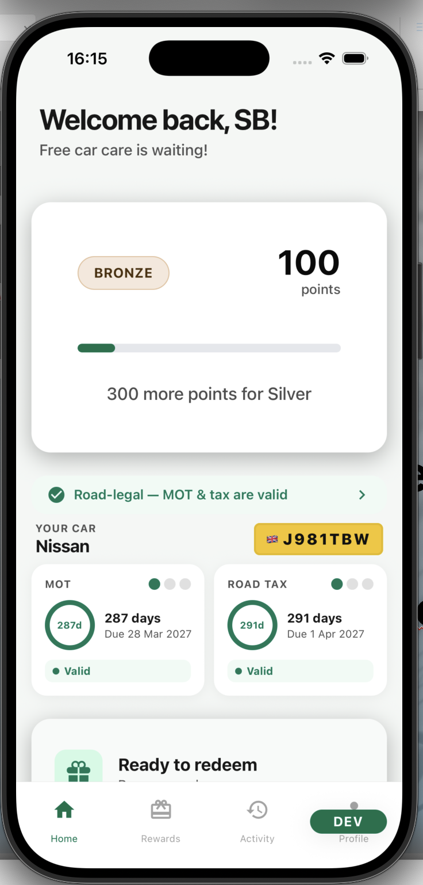
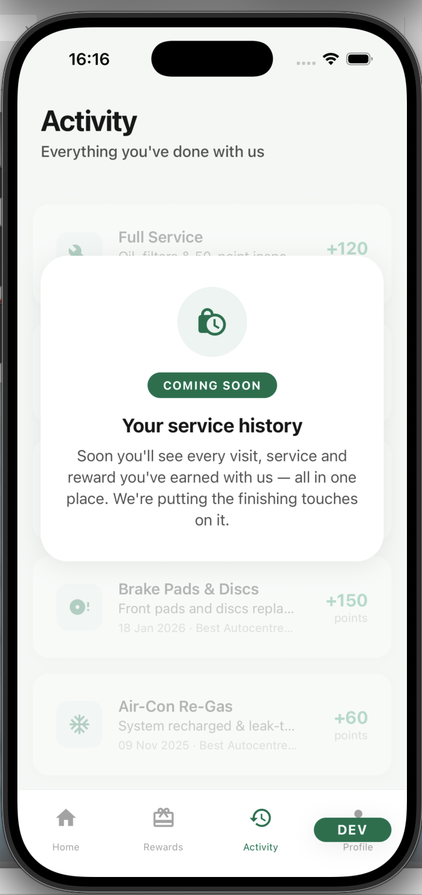
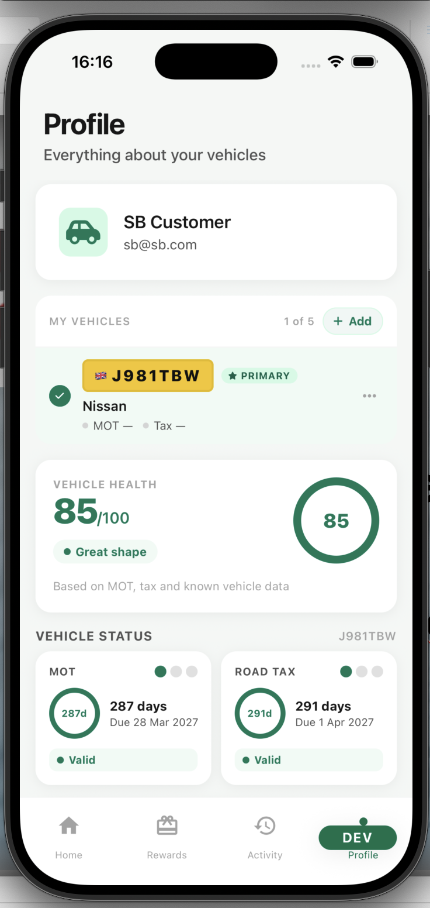
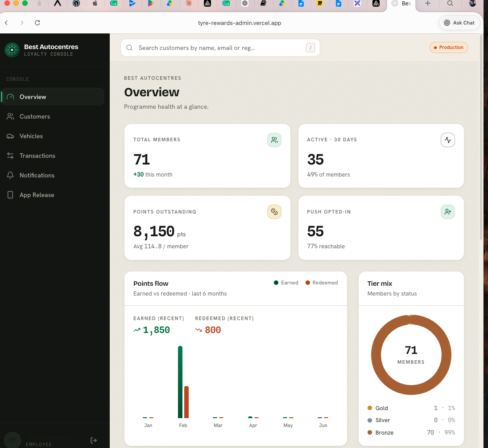
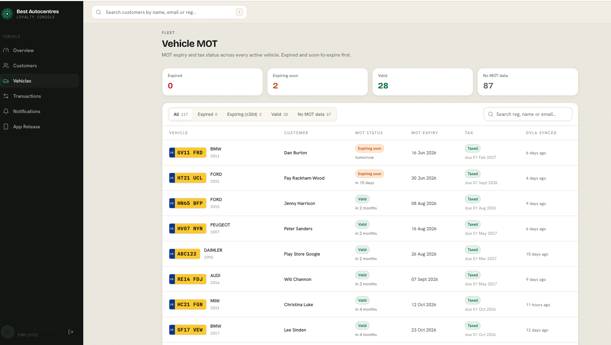

# Autopic App

##The Challenge

Most drivers have no single place to understand the state of their vehicle. Additionally, the experiance for a driver is dated and analog. The goal is to improve stickeness, create an Apple Health like experience and eventually move customers to a subscription model. 

This creates two distinct problems the app set out to solve:

- **Low engagement** — a customer may not need anything from a workshop for six to twelve months, so there is no natural reason to return, and no way to improve the relationship with the garage or the usres enjoyment and freedom of motoring.
- **No habit loop** — without proactive, useful prompts, the app risks being a one-time download rather than a tool the customer returns to, which makes it difficult to build trust or drive repeat business.

##Current Product State

The app is live and validated with real production users. It has reached a working MVP with one completed reward cycle and a small base of beta users.

- ~60 beta users and downloads
- iOS App Store release live
- Google Play live
- One completed reward cycle
- Manual admin workflow operational
- WhatsApp connection to the user
- Real production users and an active production database

The current feature set spans two areas.

**Rewards platform** — fully implemented and operationally validated with the first beta users. This covers user authentication, vehicle registration capture, the rewards mechanicism working.

**Vehicle profile & health** — implemented and functional in production, covering MOT data, vehicle tax data, a vehicle profile page with current mileage, and a generated vehicle health score from live API integrations. 

##Product Direction

The app is evolving through three functional stages, moving from a loyalty tool to a connected vehicle platform.

**Stage 1 — Loyalty & engagement platform (current).** The goal is to validate repeat engagement and build habit loops. Mesured through interviews and happy path counts.

**Stage 2 — Vehicle health platform (next major expansion).** The goal is to become a genuinely useful vehicle companion. Planned features include:

- **Vehicle health dashboard** — combining MOT, tax, advisories, tyre health, battery health, mileage and service history into a single unified vehicle health score.
- **Workshop live updates** — real-time status such as "MOT started", "inspection complete", "tyres fitted", "video uploaded" and "vehicle ready", requiring integration between Garage Hive / ERP, the admin platform, the push notification system and the app event system.
- **Digital vehicle history** — a persistent longitudinal record of invoices, service history, tyre replacements, videos, inspections and recommendations.
- **Image-based features** — building on the proof of concept for tyre tread reading from a phone, extending toward damage recognition, battery reports and AI inspection support, supported by ML inference endpoints, image uploads and async processing pipelines.

**Stage 3 — Connected vehicle platform (long-term).** The goal is to transition from a rewards app to a predictive vehicle platform.

- **Connected vehicle data** — from OEM APIs, telematics dongles, OBD devices, mileage integrations and other industry APIs such as valuations.
- **Predictive maintenance** — tyre replacement prediction, battery degradation alerts, usage anomaly detection, mileage-based servicing, terminal modelling and dynamic pricing.
- **Subscription features** — recurring models that are strong for cashflow and stickiness, such as tyres for life, service and MOT subscriptions, predictive alerts, extended history and connected diagnostics.

##Product Problems Identified

**Weak initial happy path.** Users may not immediately need what the rewards offer — MOT info, health checks, diagnostics or free services — leading to low initial engagement. 

**Lack of a habit loop.** Because a customer may not need the app for six to twelve months, there is no signal as to whether they valued it. The goal is to make the app proactive through an event engine, scheduled notifications, telemetry ingestion, health scoring and reminder automation.

**Clunky admin flow.** Users book a service via WhatsApp, but a person then has to know when the visit happens and update their points manually. Once validated, this should be automated.

##Platform Architecture

The platform is built as a mobile-first stack with a separate admin surface and a Supabase backend, supported by push and observability tooling.

Core technologies used across the platform include:

Expo, React Native and TypeScript for the mobile app
Next.js and TypeScript on Vercel for the admin panel
Supabase, Postgres and Edge Functions for the backend
OneSignal for push notifications
Sentry for error monitoring
EAS for OTA updates
Posthog for user monitoring 

##Product North Star

The long-term ambition is to build an "Apple Health for cars" — a platform offering vehicle intelligence and subscription payments.

- **Short-term** — increase monthly engaged vehicles and users, and get the user to take an action based on a trigger we send.
- **Mid-term** — make the platform sticky, with users logging in to check or add details such as mileage.
- **Long-term** — vehicle intelligence and subscription payments at the centre of the customer relationship.

##Suggested Next Steps

The sprint goal is to stabilise production and create repeat engagement. The recommended scope (all in draft) spans engineering, product and infrastructure. 

- **Engineering** — complete OneSignal user linkage, create per-user notifications with a trigger mechanism (manual to start), add production deployment and version safeguards, add better user behaviour tracking, and build a better system to update points, potentially linked to database info.
- **Product** — design notification strategy sequences and triggers, improve onboarding positioning (including lost password recovery), add a clearer "vehicle health" narrative, build a better reward point structure and triggers, and map customer empathy around their biggest pain points.
- **Infrastructure** — improve the staging/release workflow, improve Sentry tracing, add user behaviour tracking, add a deployment rollback process, and improve environment/version visibility.

##The App

**1. Home screen**

**2. Activity screen**

**3. Profile screen**

##The Admin Panel

The Next.js admin console is where the workshop manages the loyalty programme — viewing programme health at a glance and overseeing the vehicle fleet, customers, transactions and notifications. It is also where the current manual workflows, such as point allocation and member management, are carried out while automation is being built.

**1. Overview — programme health at a glance, covering members, active users, outstanding points and tier mix**

**2. Vehicles — MOT and tax status across every active vehicle, with DVLA sync and expiry tracking**

##The repositries

- https://github.com/Autopic/reward_app
- https://github.com/Autopic/privacy-policy
- https://github.com/tobynbrooks/autopic1.2
- https://github.com/tobynbrooks/reward_autopic
