# Tyre Image Recognition

##The Challenge

Tyre inspection sits at one of the most sensitive points in the customer relationship. When a customer brings a vehicle in to have their tyres checked, they are almost entirely reliant on the word of the person inspecting them. They cannot easily see the tread, they cannot independently verify the measurement, and they have no simple way of knowing whether a tyre genuinely needs replacing.

This created two distinct problems the project set out to solve:

- **Information asymmetry** — the customer has no objective, repeatable view of the condition of their own tyres and must trust the assessment given to them in the shop. Trust is at the core of the customers problem with the auto repair industry.
- **Physical dependency** — a tyre can only be checked if the customer brings the vehicle to a shop, which limits how and when an inspection can take place.

The objective was to build a system capable of producing a consistent, evidence-based tread measurement from images alone, removing subjectivity from the inspection and creating the foundation for a check that could eventually be performed without the customer needing to attend a workshop at all.

##Modelling Framework

The development work focused on building a computer vision pipeline capable of inferring tread depth directly from images of a tyre. That could be used from a smart phone. 

##Operationalisation

The project reached proof of concept, demonstrating that the pipeline could make a tread depth inference accurate to within 1.2mm. This was achieved with a total of ~6,000 images, including synthetically generated ones.

Supporting tooling was built around the model to capture training data, record tyre footage, extract frames, attach metadata, and compare model performance. This created a repeatable workflow for collecting labelled images and improving the model over successive iterations.

At this stage the system proved the core hypothesis: that tread depth could be inferred from images alone with meaningful accuracy, and that the process could be operationalised through a structured data capture and training loop.

##Strategic Outcome

The project demonstrated a credible route to removing asymmetry from the tyre inspection process. By grounding the assessment in an objective, image-based measurement, the customer is no longer reliant solely on the word of the person performing the check.

It also established the technical foundation for a check that does not depend on the customer attending a shop, opening the possibility of tyre assessment becoming a self-service step within the wider customer journey.

The ~1.2mm accuracy achieved at proof of concept is sufficient to validate the approach. With further work — collecting higher quality images at scale and potentially replacing the current feature extraction approach with a convolutional neural network (CNN) — the system has a clear path toward production, and is expected to form part of the customer journey at some stage.

##Platform Architecture

The platform was developed as a modular computer vision pipeline, combining segmentation, object detection, visual feature embedding, and a trained statistical model to produce a tread depth inference.

Core technologies used across the platform include:

YOLO for tyre detection and zonal segmentation
Florence 2 for visual feature embedding
Random Forest for tread depth inference
Cloudinary for image and frame storage
Python-based training, inference, and tooling
SAM segmentation tool
EXPO for front end

The architecture prioritised rapid iteration, allowing new labelled images to be incorporated and the model retrained as better data became available.

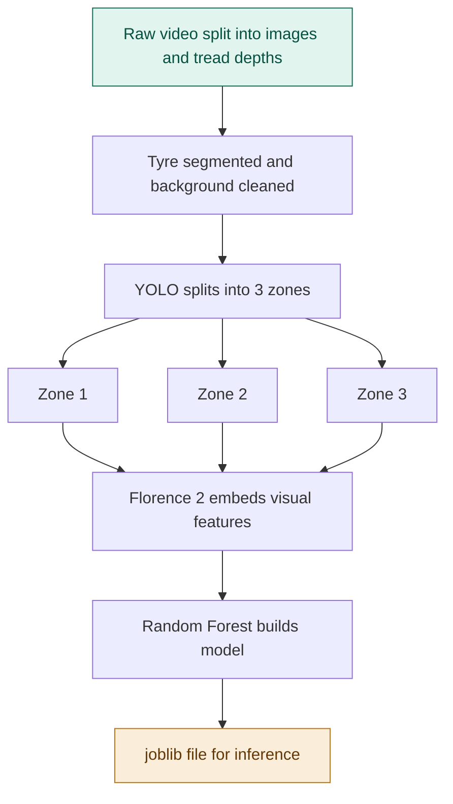

The screenshots below follow the project end to end, from capturing labelled training data, through storage and the modelling pipeline, to the customer-facing inference app.

**1. Data capture for the training models — upload a tyre video**

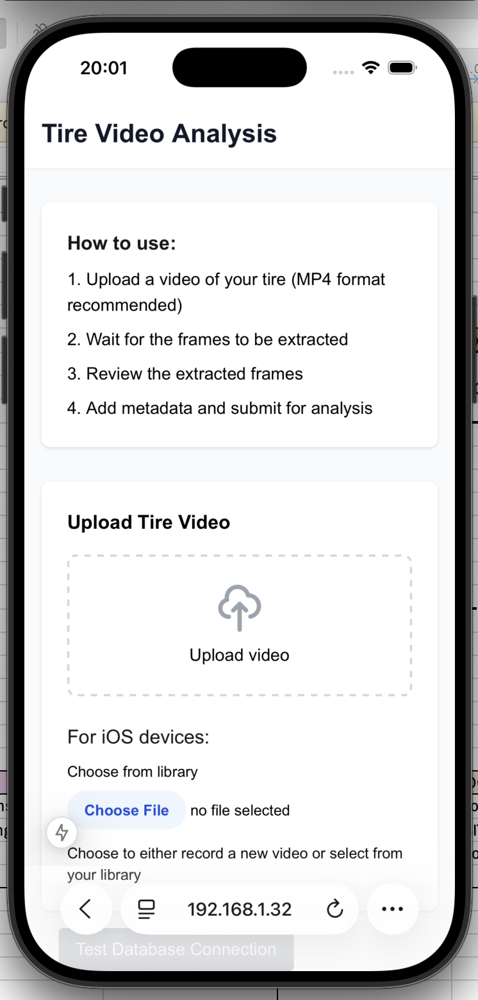

**2. Data capture — record tyre size, vehicle, brand, and ground truth tread depths**

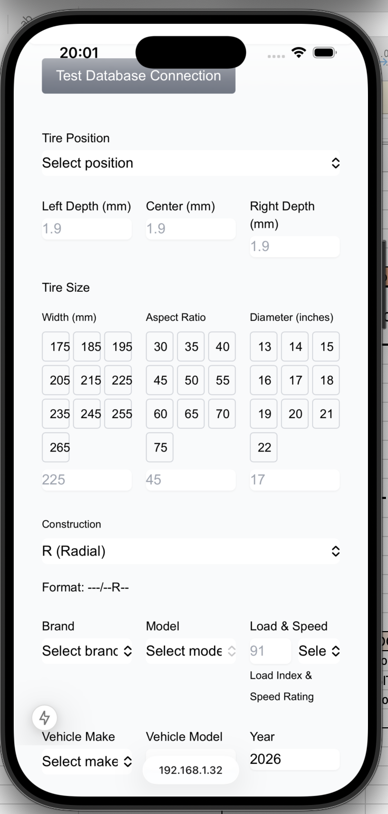

**3. Data capture — record condition metadata and save**

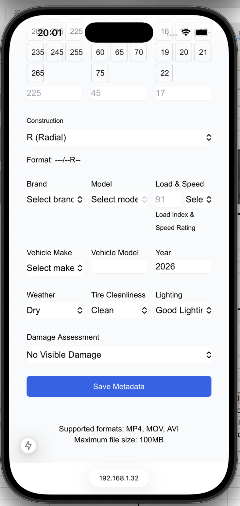

**4. Storage — extracted frame held in Cloudinary**

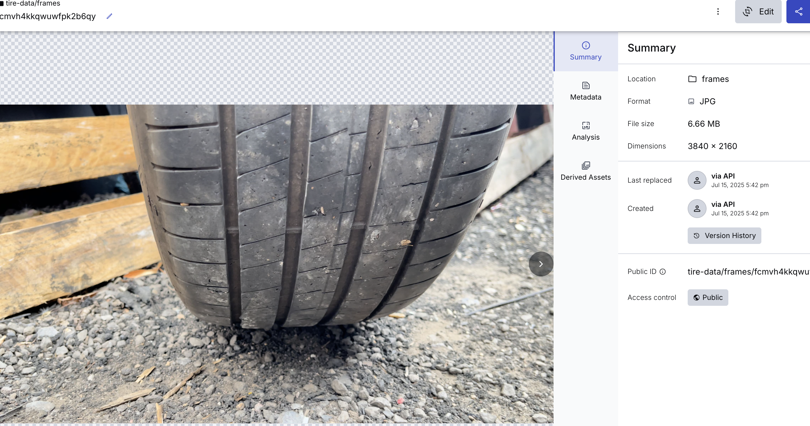

**5. Storage — extracted frame URLs in the SQL database**

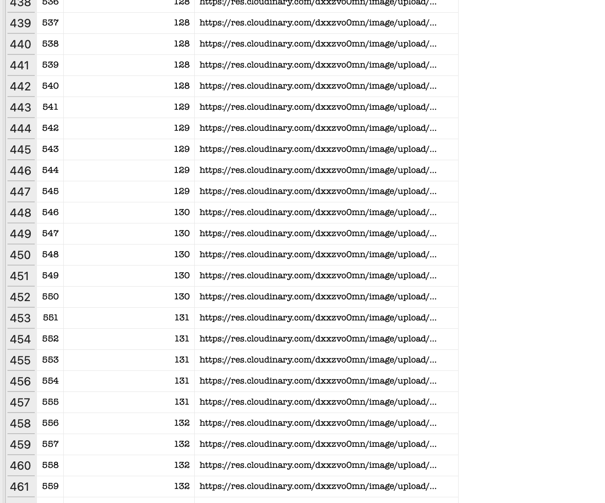

**6. Dataset — labelled tread measurements in SQL database**

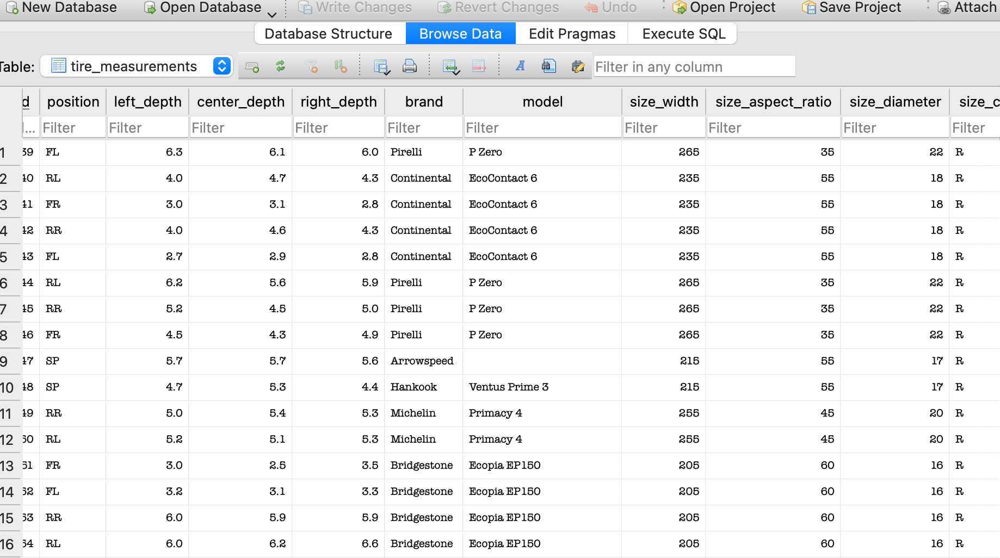

**7. Dataset — captured volume of base frames and measurements**

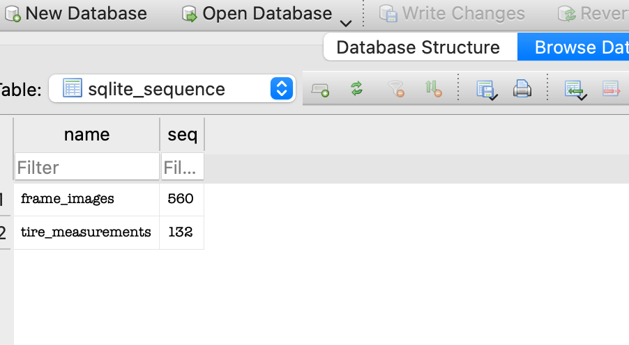

**8. Modelling — Finetuned YOLO splits the tyre into left, centre and right zones**

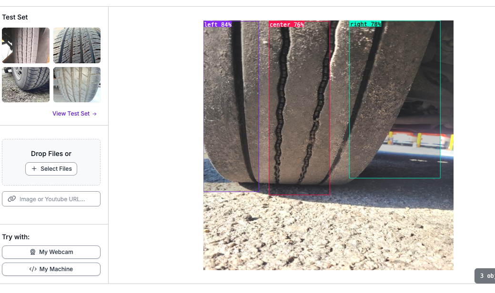

**9. Modelling — comparing model performance to select the best**

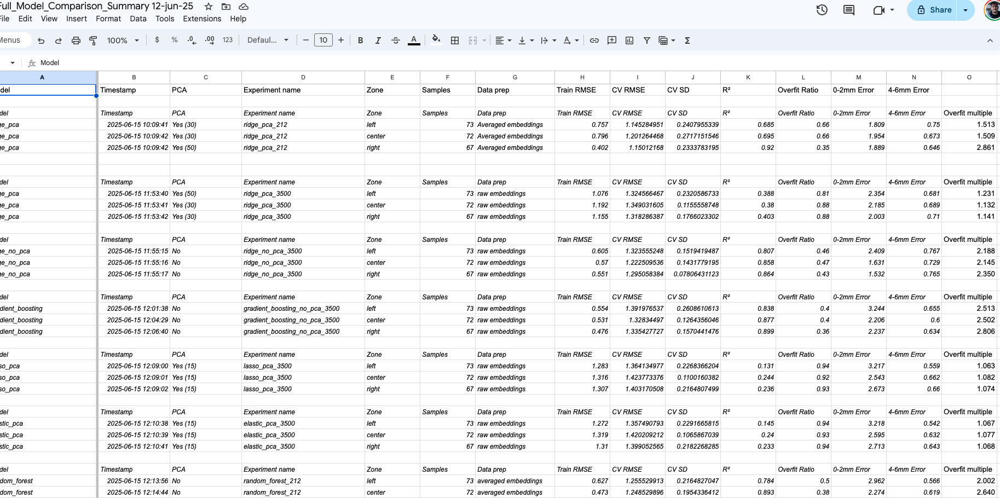

**10. Inference app — customer starts an analysis now running the inference pipeline and best model via API**

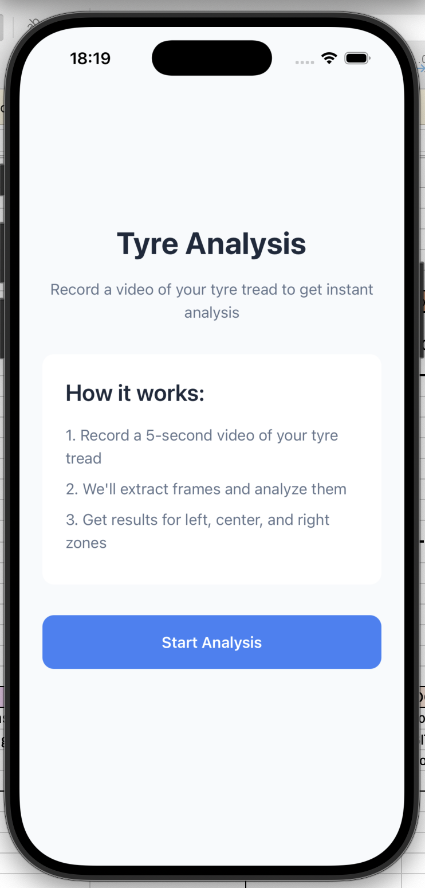

**11. Inference app — customer records the tyre tread (note: API no longer running)**

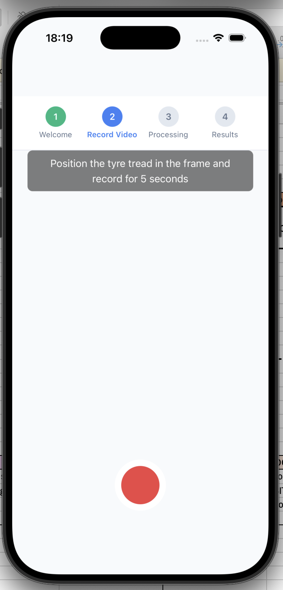

##The repositries
https://github.com/tobynbrooks/yolo_pipeline
https://github.com/tobynbrooks/inference_tyre
https://github.com/tobynbrooks/inference_expo_ui
https://github.com/tobynbrooks/resnet_tyres
https://github.com/tobynbrooks/tyrelabel
https://github.com/tobynbrooks/frame_data
https://github.com/tobynbrooks/tyre-data-tool

