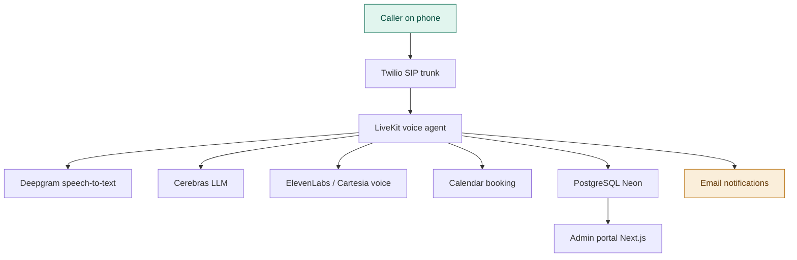
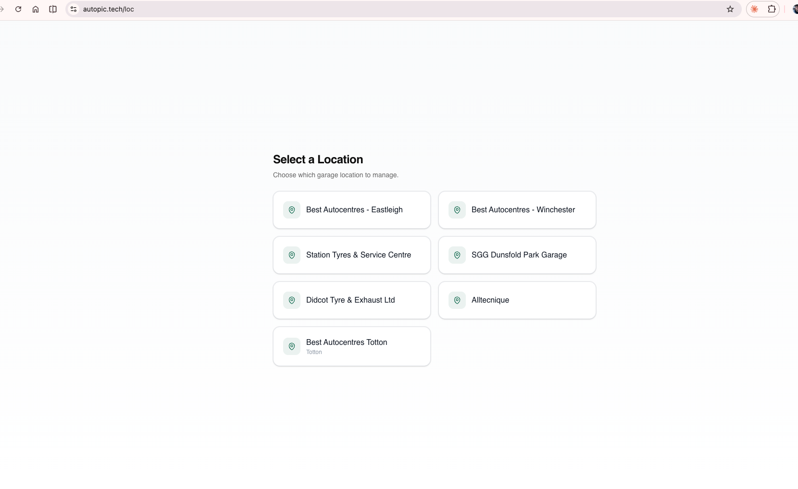
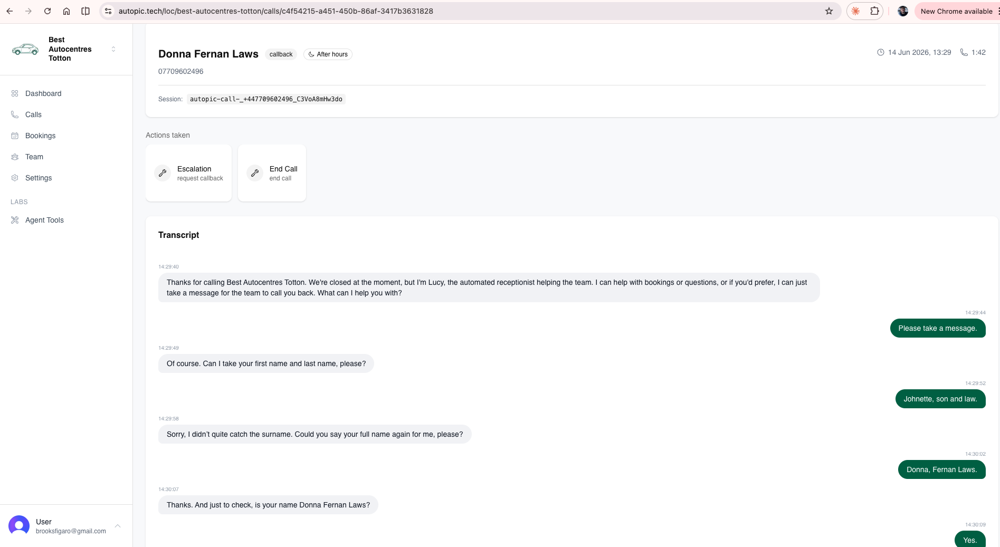
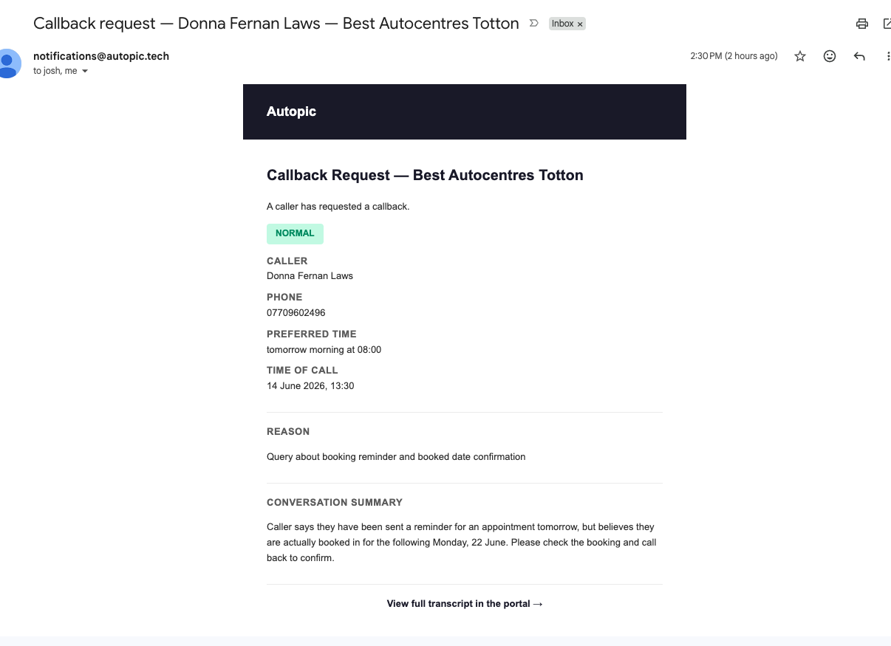
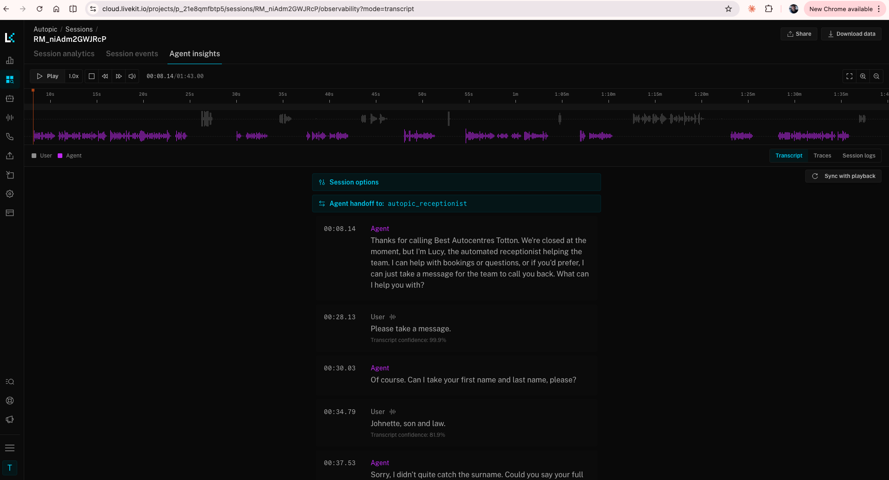

# Voice Agent Receptionist

##The Challenge

Our ahops, and most others, lose business every time a phone goes unanswered. Calls come in outside of opening hours, during busy periods on the workshop floor, or when the front desk is already on another line. Each missed call is a potential booking lost to a competitor, and there is rarely any record that the call even happened.

The scale of the problem is significant: some sites miss up to 20% of their calls on busy days, and with each job worth approximately £200 to the business, those unanswered calls add up to substantial lost revenue every week.

This creates two distinct problems the voice agent set out to solve:

- **Missed revenue** — after-hours and overflow calls go to voicemail or ring out entirely, so customers who want to book a service simply call the next garage on their list.
- **No visibility** — without a record of who called, why, and what was said, the team has no way to follow up, no way to measure demand, and no way to improve how enquiries are handled.

##What It Does

The Voice Agent is an AI-powered receptionist that answers calls on behalf of a garage, holding a natural, real time conversation with the caller. It is designed to provide a professional, always available presence without the cost of additional staffing.

The agent can:

- **Answer calls** — pick up after hours and missed calls with a natural sounding voice and handle interruptions like a real receptionist.
- **Book appointments** — check availability and schedule a service against the garage calendar, reading the details back to the caller for confirmation. (currently being rebuilt).
- **Take messages** — capture the caller's name, number, reason for calling and a summary of the conversation for the team to follow up.
- **Answer common questions** — respond accurately to FAQs about hours, location, services and pricing using a configured knowledge base.
- **Escalate and request callbacks** — recognise when a query needs a human and route a callback request to the team by email.

##Primary Objectives

- Ensure no after hours call goes unanswered.
- Allow customers to book appointments 24/7.
- Capture messages and caller details for reliable follow-up.
- Provide full visibility into every interaction through a simple admin portal.

##Platform Architecture

The platform pairs a real time voice pipeline with a Next.js admin portal and a Postgres backend. The voice agent is built on the LiveKit Agents framework, with calls routed in over a Twilio SIP trunk. Speech is transcribed in real time, processed by a fast hosted LLM, and spoken back through a natural text-to-speech voice — all engineered for low latency so the conversation feels natural.

Core technologies used across the platform include:

- LiveKit Agents for the real-time voice pipeline
- Twilio (SIP trunk) for telephony and the dedicated phone number
- Deepgram for speech-to-text transcription
- Cerebras-hosted models for fast, low-latency LLM responses
- ElevenLabs / Cartesia for natural voice synthesis
- Next.js on Vercel for the admin portal
- Clerk for authentication
- PostgreSQL (Neon) with Drizzle ORM for the database

##Appointment Booking

The agent checks availability before offering slots, books appointments with the customer's name, phone and service type, and confirms the details back to the caller. Notifications of new bookings are sent to the team by email. 

##Knowledge Base Configuration

The agent's responses are driven by a garage knowledge base, ensuring answers are accurate and on brand. This covers:

- Business hours and location information
- Appointment types and durations, services offered and general pricing guidance
- Common FAQs such as payment methods and preparation instructions
- Booking rules including lead time, available slots and service constraints

##Roadmap

The current build delivers the MVP described above. Future enhancements under consideration include:

- Automatic call forwarding after business hours, to manage and review the MVP.
- Support for multiple phone numbers and locations

##The Admin Portal

The Next.js portal is where the team oversees every interaction handled by the agent. Access is secured via Clerk authentication, and each garage location is managed separately. The portal exposes the full call log, complete transcripts, the actions the agent took on each call, messages left for callback, and the appointments booked — all filterable and searchable by date range and action type.

**1. Location selector — choose which garage location to manage**

**2. Call detail — full transcript and a clear record of the actions the agent took, such as escalations and callback requests**

##Notifications

When a caller requests a callback or leaves a message, the team receives an email with the caller's name, phone number, preferred time, the reason for the call and a summary of the conversation — with a link straight through to the full transcript in the portal.

**Callback request email notification**

##Observability

Every session is fully observable through LiveKit, giving a synced audio waveform, a timestamped transcript with transcription confidence, agent handoffs, traces and session logs. This makes it straightforward to review real calls, tune conversation flows and diagnose any edge cases.

**LiveKit session observability**

##The Repository

- https://github.com/Adder-Analytics/autopic
