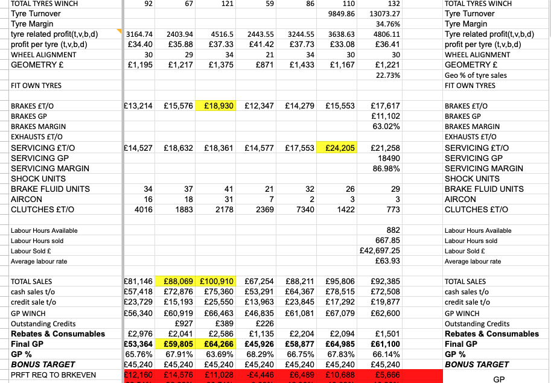
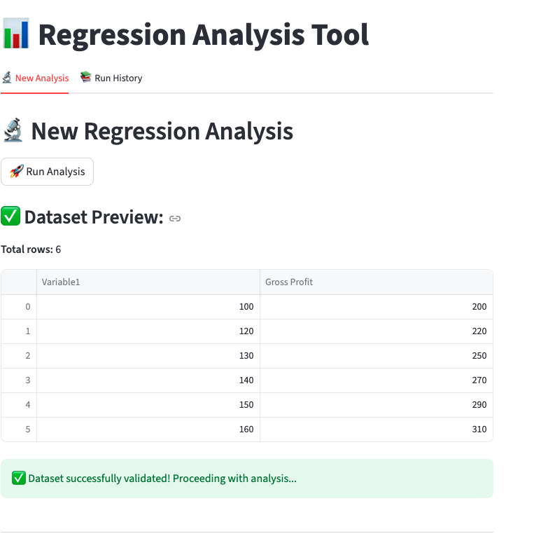
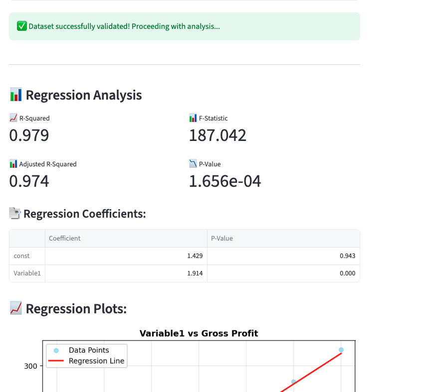
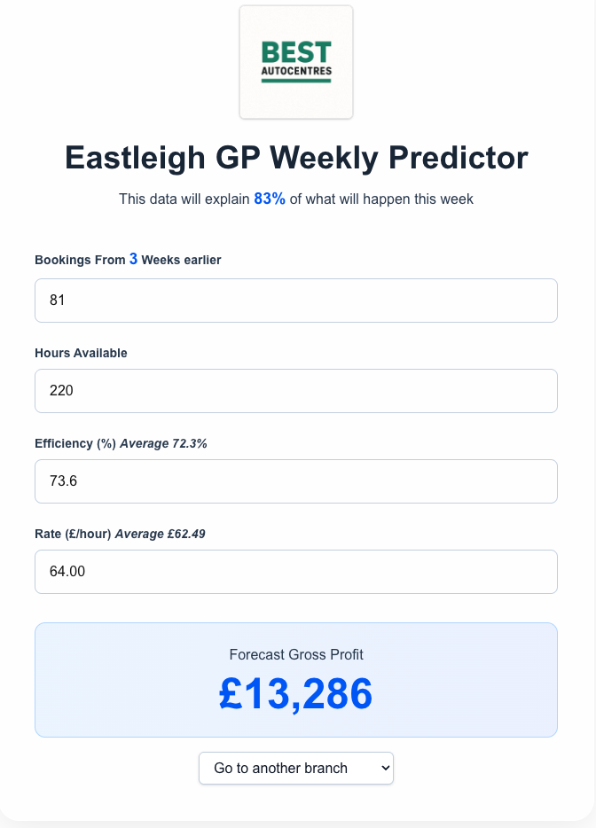

# Operational Forecasting Platform

##Operational Challenge

As Best Autocentres expanded through acquisitions, the scale and complexity of operational data increased significantly across the group. Existing reporting tools were capable of filtering information, but they were not designed to identify which operational drivers genuinely mattered, how they interacted, or where management attention should be focused.

The challenge was not a lack of data, but the growing difficulty of interpreting it consistently across multiple sites, workflows, and business units.

To support scalable operations, the business needed a framework capable of simplifying operational visibility and identifying the variables most closely linked to financial performance.

The initial datasets inherited from acquired businesses included:

- 400+ rows of operational records
- 280+ operational and financial dimensions
- Multiple workshops and business units

Combined transactional, financial, operational, and workshop performance data

The result was a fragmented and increasingly noisy operating environment that became more difficult to manage as the platform scaled.

##Modelling Framework

The initial development work focused on building lightweight modelling tools capable of rapidly analysing relationships between operational variables and financial outcomes.

Early systems were designed to:

Run regression and correlation analysis across operational datasets

Identify statistically significant drivers of gross profit

Reduce noise within large operational datasets

Improve visibility across workshop performance

Support faster operational decision-making

The objective was not simply reporting, but the creation of an operational decision layer capable of highlighting where management focus generated the greatest financial impact.

##Operationalisation

The modelling work became the foundation for the group’s first structured weekly operational dashboards.

Over time, the software enabled management to reduce hundreds of variables into a focused set of key operational metrics that could be monitored consistently across the platform.

This work ultimately supported the creation of a regression-based planning system, allowing the business to forecast performance using a smaller number of operational inputs that were measurable, predictable, and actionable.

The transition from historical reporting toward forward-looking operational planning represented a significant step in improving scalability across the organisation.

##Streategic Outcome

The systems developed through this process helped shape the group’s understanding of productive work, operational bottlenecks, and the relationship between workshop activity and financial performance.

The outputs from the modelling framework also informed the strategic decision to migrate toward a more unified ERP and operational data infrastructure in 2026.

More broadly, the project demonstrated the importance of building internal operational tooling capable of transforming fragmented workshop data into actionable management insight.

##Platform Architecture

The platform was developed using a lightweight, modular architecture designed to support rapid operational analysis, forecasting, and dashboard deployment across multiple business units.

Core technologies used across the platform include:

Python-based statistical and regression engines
Streamlit operational dashboards
Next.js and TypeScript web interfaces and local sotorage with CSV output.
Vercel deployment infrastructure for rapid iteration and internal tooling distribution

The architecture prioritised rapid operational deployment, scalability of analysis, and the ability to iterate quickly as new operational datasets became available.

##The repositries

https://github.com/tobynbrooks/GP_Planner

https://github.com/tobynbrooks/gp-regression

