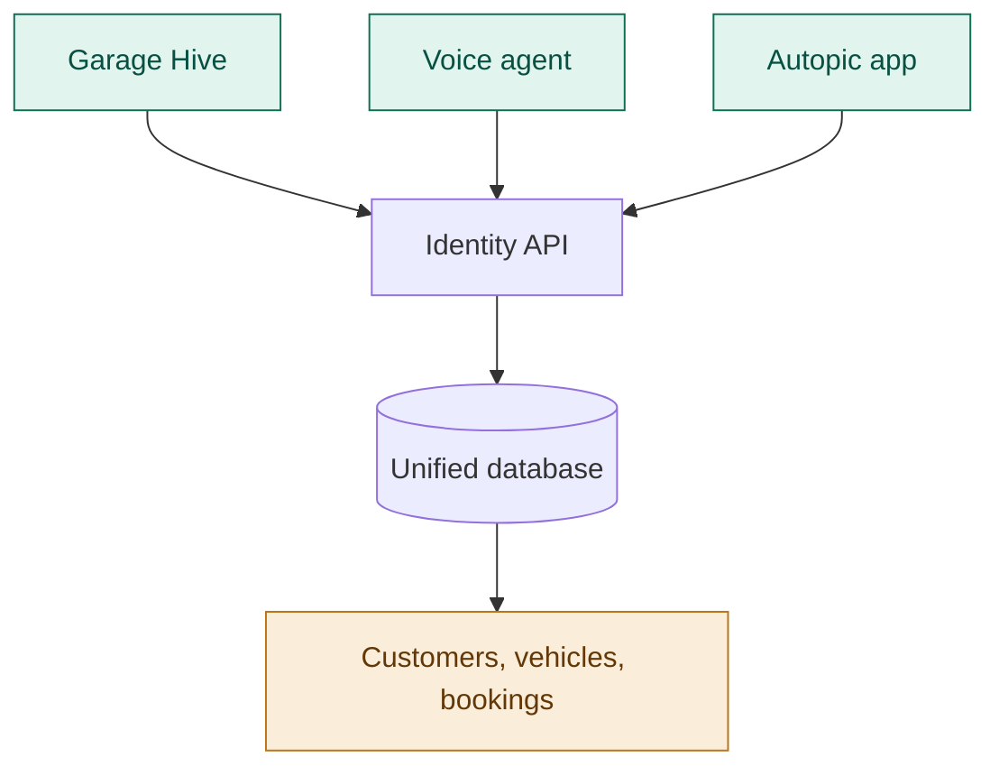
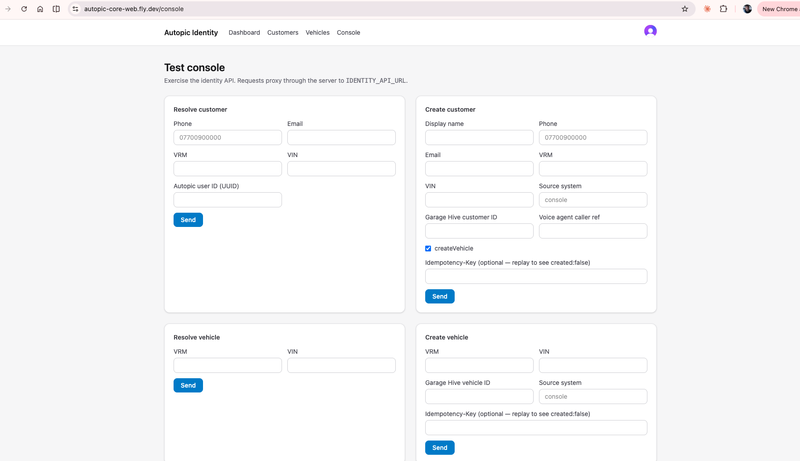

# Unified Database

##The Challenge

Across the business, customer, vehicle, CRM, HR, email and booking data lives in separate systems and various spreadsheets. The same customer or vehicle can exist in several places under different identifiers, with no single source of truth. This makes it hard to build a complete picture of a customer, to share data safely between tools, and to build new AI and automation features on top of reliable foundations.

The unified database sets out to be the central, authoritative record that every other system reads from and writes to. Fully legible to AI agents. 

##What It Does

The unified database provides a single, shared data model for customers, vehicles, sites, services, employees and bookings. It is designed to:

- **Resolve identities** — match a customer or vehicle across systems using phone, email, VRM, VIN and the external IDs held by each platform.
- **Hold external references** — store each system's own ID alongside our canonical record, so data can flow between platforms without duplication.
- **Act as the source of truth** — give every product, from the voice agent to the customer app, one consistent place to look up and update records.

##Primary Objectives

- Establish a single canonical record for customers, vehicles and bookings.
- Integrate with the core operational systems, starting with Garage Hive.
- Provide a stable, production-ready foundation for AI and automation features.
- Expose simple, reliable interfaces for resolving and creating records.

##Platform Architecture

The unified database sits at the centre of the platform. Each connected system — Garage Hive, the voice agent and the customer app — reads from and writes to it through an identity API, which resolves records against the canonical model and keeps external references in sync. The service is built to run on Microsoft Azure.

##Data Model

The model is anchored on the **customer**, identified by a canonical `customer_id`. This identifier ties together a customer's vehicles, bookings and the external references held by each system — Garage Hive IDs, voice agent IDs and Autopic user IDs — allowing records to be resolved and reconciled across platforms. A booking then sits across these, referencing the customer, vehicle, site and service for a given job. (V1 draft of schema.), not final. 

##The Test Console

A web console exercises the identity API, proxying requests through the server. It allows records to be resolved and created by phone, email, VRM, VIN or external ID, and is used to validate the data model and integrations as they are built.

##Roadmap

The platform is at an early stage. The data model is defined, the **Garage Hive** integration is being installed in a snadbox, and the service is being deployed to Microsoft Azure. Planned next steps include:

- Hosting the production service on Azure.
- Connecting the voice agent and customer app to the unified record.
- Defining usage monitoring and billing for the AI features built on top of the database.
